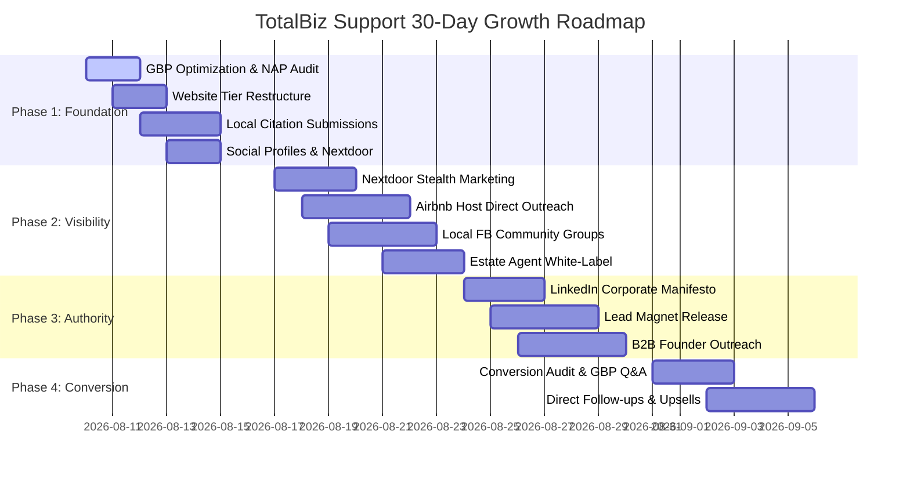

# Master 30-Day Digital Marketing Strategy — TotalBiz Support

## Executive Strategy Overview
TotalBiz Support operates a **dual-tiered growth engine**:
1. **Tier 1 (Hyper-Local East Sussex):** Dominating hands-on IT, Mesh Wi-Fi, Smart Home/Locks, and Web/Admin setups across Heathfield, Uckfield, Lewes, Eastbourne. Provides immediate cashflow and local trust.
2. **Tier 2 (National Remote UK-Wide):** Scalable Web & Mobile App development (powered by Clarviz white-label backend), TOM Strategy Consulting, Fractional COO advisory, and Airbnb Automated Dynamic Pricing management via Google Meet.

---

## 30-Day Execution Roadmap Schedule

---

## Detailed 30-Day Day-by-Day Action Breakdown

### Phase 1: Foundation & Asset Setup (Days 1–7)
- **Day 1 (TODAY):** Google Business Profile Optimization & NAP Consistency Audit.
- **Day 2:** Restructure `totalbiz.co.uk` navigation menu to clearly delineate Local On-Site Support (Tier 1) vs Remote Strategic Consultancy (Tier 2).
- **Day 3:** Local Citation Deployment — Submit standardized NAP to top 25 UK directories (Yell, Thomson Local, FreeIndex, Bing Places, Apple Maps).
- **Day 4:** Social Media Profile Overhaul — Update LinkedIn and Facebook pages with "Rolls-Royce Mechanic for Small Business" positioning and corporate IT pedigree.
- **Day 5:** Nextdoor Business Page Claiming & Verification for Heathfield / East Sussex.
- **Day 6:** Automated Review Capture Setup — Create frictionless SMS/Email review request templates for 5-star Google reviews.
- **Day 7:** Google Search Console & Analytics 4 Tag Audit — Ensure tracking across all landing pages.

### Phase 2: Local Visibility & Community Outreach (Days 8–14)
- **Day 8:** Nextdoor "Value First" Post — Share non-promotional guide on fixing Wi-Fi dropouts in thick stone Sussex walls.
- **Day 9:** Airbnb Host Outreach Campaign — Direct pitch for Smart Lock & Mesh Wi-Fi audits + Automated Dynamic Pricing engine.
- **Day 10:** Local Facebook Group Integration (Heathfield Community Hub, East Sussex Business Network).
- **Day 11:** Google Business Profile Photo Batch & First Update Post.
- **Day 12:** Estate Agent & Property Manager Partnership Outreach in Heathfield/Uckfield.
- **Day 13:** Nextdoor "Local Deal" Launch (£50 off Mesh Wi-Fi Audit for Heathfield residents).
- **Day 14:** Historical Review Push — Contact past satisfied clients for Google 5-star reviews.

### Phase 3: National Authority & Lead Generation (Days 15–21)
- **Day 15:** LinkedIn Manifesto Post — "Why I Left Corporate IT (HSBC/eBay) to Help Small Businesses."
- **Day 16:** Lead Magnet Release — "The Sole Trader's 5-Minute Guide to Tax & Invoicing Automation."
- **Day 17:** B2B Prospect List Building — Target 100 UK founders (10–50 employees) for Fractional COO consulting.
- **Day 18:** Strategic Warm Outreach on LinkedIn.
- **Day 19:** Website Case Study Publication (System migration / White-label app dev example).
- **Day 20:** Multi-Channel Content Distribution (LinkedIn & UK Business Forums).
- **Day 21:** Local SEO Geo-Grid Audit — Measure Local 3-Pack rank across East Sussex towns.

### Phase 4: Conversion Optimization & Scaling (Days 22–30)
- **Day 22:** Website Conversion Audit — Add direct "Book a Free 15-Minute Google Meet Audit" CTAs.
- **Day 23:** Google Business Profile Q&A Seeding (Pre-populate common local questions).
- **Day 24:** Outreach Follow-Ups (Estate agents & Airbnb hosts).
- **Day 25:** LinkedIn Post 2 — "Demystifying Target Operating Models for 5-Person Teams."
- **Day 26:** Directory Citation Verification & Indexing Check.
- **Day 27:** Cross-Tier Upsell Protocol (Converting local Wi-Fi clients into Web/App or TOM consulting clients).
- **Day 28:** Content Calendar Batching for Month 2.
- **Day 29:** Monthly Metrics Review (GBP calls, website visits, discovery calls).
- **Day 30:** "Hero Client" Transformation Case Study Release across all platforms.
